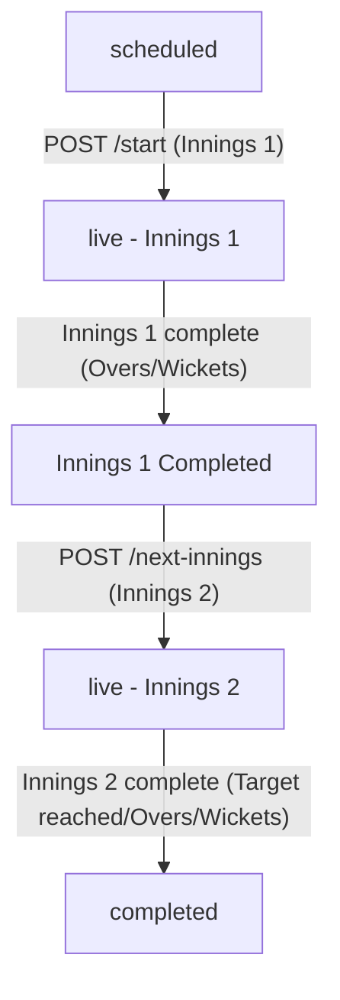

# Cricket Scoring Module API Reference Guide

This document lists all the routes, request body JSONs, and query parameters for testing and verifying the Cricket Scoring Module.

> [!NOTE]
> Read-only endpoints (`GET /v1/cricket/grounds`, `GET /v1/cricket/teams`, `GET /v1/cricket/teams/:id`, `GET /v1/cricket/matches/:id/scorecard`) are public and do NOT require authentication.
> All creation, match-setup, and scoring edit endpoints (`POST` / `PATCH`) require a Bearer token in the `Authorization` header: `Authorization: Bearer <your_jwt_access_token>`.

---

## 1. Ground Management

### Create Ground
- **Endpoint:** `POST /v1/cricket/grounds`
- **Headers:** `Content-Type: application/json`, `Authorization: Bearer <token>`
- **Request Body JSON:**
  ```json
  {
    "name": "Wankhede Stadium",
    "city": "Mumbai",
    "country": "India"
  }
  ```
- **Response:** `201 Created` on success.

### Get All Grounds
- **Endpoint:** `GET /v1/cricket/grounds`
- **Headers:** `Authorization: Bearer <token>`
- **Response:** `200 OK` on success, listing all grounds.

---

## 2. Team Management

### Create Team
- **Endpoint:** `POST /v1/cricket/teams`
- **Headers:** `Content-Type: application/json`, `Authorization: Bearer <token>`
- **Request Body JSON:**
  *Note: `userId` must exist in `auth.users`. Exactly one captain and wicketkeeper required.*
  ```json
  {
    "name": "Mumbai Indians",
    "players": [
      {
        "userId": "60d5ec49e29a3e2154ad5c4a",
        "role": "batsman",
        "isCaptain": true,
        "isWicketKeeper": false
      },
      {
        "userId": "60d5ec49e29a3e2154ad5c4b",
        "role": "wicket_keeper",
        "isCaptain": false,
        "isWicketKeeper": true
      },
      {
        "userId": "60d5ec49e29a3e2154ad5c4c",
        "role": "bowler",
        "isCaptain": false,
        "isWicketKeeper": false
      }
    ]
  }
  ```
- **Response:** `201 Created` with `teamId` on success.

### Get All Teams
- **Endpoint:** `GET /v1/cricket/teams`
- **Headers:** `Authorization: Bearer <token>`
- **Response:** `200 OK` listing teams.

### Get Team Details (By ID)
- **Endpoint:** `GET /v1/cricket/teams/:id`
- **Headers:** `Authorization: Bearer <token>`
- **Response:** `200 OK` with populated team details including player names/phones.

---

## 3. Match & Scoring Management

The match module acts as a state machine that handles match setups, coin-toss decisions, ball-by-ball recording, over completions, innings transitions, and final results calculation.

### ── Match Lifecycle Overview ──


---

### ── Step-by-Step API Scoring Workflow & Logic ──

#### Step 1: Schedule the Match
First, schedule the match by linking a cricket ground, two team IDs, game format, overs per innings, and the coin toss result.
- **Endpoint:** `POST /v1/cricket/matches`
- **Request Body JSON:**
  ```json
  {
    "groundId": "60d5ec49e29a3e2154ad5c33",
    "teamAId": "60d5ec49e29a3e2154ad5c11",
    "teamBId": "60d5ec49e29a3e2154ad5c22",
    "format": "T20",
    "overs": 20,
    "toss": {
      "wonBy": "60d5ec49e29a3e2154ad5c11",
      "decision": "bat"
    }
  }
  ```
- **What happens:** The server schedules the match and assigns it status `"scheduled"`. The batting/bowling assignments are automatically mapped based on the toss decision (e.g. since Team A won and chose to "bat", Team A bats first, Team B bowls first).

#### Step 2: Start Innings 1
Begin the live match by setting the initial on-field players.
- **Endpoint:** `POST /v1/cricket/matches/:id/start`
- **Request Body JSON:**
  ```json
  {
    "strikerId": "60d5ec49e29a3e2154ad5c4a",      // First batsman facing ball
    "nonStrikerId": "60d5ec49e29a3e2154ad5c4b",   // Partner at bowler's end
    "bowlerId": "60d5ec49e29a3e2154ad5c4c"        // Initial bowler
  }
  ```
- **What happens:** The status transitions to `"live"`. The server initializes the innings structure, sets up stats records for these 3 active players, and starts tracking the state.

#### Step 3: Record Deliveries (Ball-by-Ball)
Call this API for every delivery bowled. The system automatically computes scores, runs, overs, and individual statistics.
- **Endpoint:** `POST /v1/cricket/matches/:id/ball`

##### **Core Scoring Rules Applied Automatically by Server:**
1. **Valid Ball:** A ball is valid if it is NOT a `wide` or a `no_ball`. The over ball count (e.g. 0.1, 0.2) only increments on valid balls.
2. **Runs Distribution:** 
   - Normal runs are added to the Team total and the Striker's stats.
   - Wides/No-Balls add a 1-run penalty to the Team total and are marked under extras.
   - Byes/Leg-byes add runs to the Team total and are marked under extras (0 runs added to striker).
3. **Striker Swapping:** 
   - The striker and non-striker automatically swap roles if **odd runs** (1, 3, 5) are scored.
   - They swap roles automatically when an **over completes** (6 valid deliveries bowled).
4. **Wicket Fall:** 
   - If a wicket occurs, the dismissed batsman's stats are marked `out: true` and their dismissal details (LBW, Bowled, Caught, etc.) are recorded.
   - If the batting team still has bench players, you **must** supply `nextBatterId` in the body payload. The incoming batter replaces the out player and takes strike by default (unless it's the end of the over).
5. **Over Completion & Bowler Switch:**
   - When 6 valid balls are completed, the over finishes.
   - **Consecutive Bowler Rule:** A bowler cannot bowl two consecutive overs. When the over ends, you can specify the `nextBowlerId` in the final ball request (or update the bowler in the next ball request). The server validates that the new bowler is not the same as the previous over's bowler.

##### **Ball Payload Examples:**

- **Normal Dot Ball or Boundary (e.g. 4 runs off the bat):**
  ```json
  { "runs": 4 }
  ```

- **Wide Ball (1 run penalty. Ball is invalid):**
  ```json
  {
    "runs": 0,
    "extras": { "type": "wide", "runs": 0 }
  }
  ```

- **No-Ball (1 run penalty. Ball is invalid + Next ball is Free Hit):**
  ```json
  {
    "runs": 1, // runs scored off bat on this No-Ball
    "extras": { "type": "no_ball", "runs": 0 }
  }
  ```

- **Wicket (Caught. Striker is out. New batter comes in):**
  ```json
  {
    "runs": 0,
    "wicket": {
      "type": "caught",
      "playerOutId": "60d5ec49e29a3e2154ad5c4a", // Striker out
      "nextBatterId": "60d5ec49e29a3e2154ad5d00"  // Incoming batsman
    }
  }
  ```

- **Over Completion Ball (6th valid ball + switch bowler to Gaikwad):**
  ```json
  {
    "runs": 1,
    "nextBowlerId": "60d5ec49e29a3e2154ad5c4e" // New bowler for next over
  }
  ```

- **First Ball of a New Over (Alternative way to switch the bowler):**
  ```json
  {
    "runs": 0,
    "bowlerId": "60d5ec49e29a3e2154ad5c4e" // Sets the new bowler for this over
  }
  ```

#### Step 4: Start Innings 2 (The Run Chase)
Once Innings 1 is completed (either 10 wickets lost or all overs completed), you must launch the 2nd Innings.
- **Endpoint:** `POST /v1/cricket/matches/:id/next-innings`
- **Request Body JSON:**
  ```json
  {
    "strikerId": "60d5ec49e29a3e2154ad5c4c",      // Chasing team's opener 1
    "nonStrikerId": "60d5ec49e29a3e2154ad5c4d",   // Chasing team's opener 2
    "bowlerId": "60d5ec49e29a3e2154ad5c4a"        // Defending team's bowler
  }
  ```
- **What happens:** The server sets the active innings to 2 and initializes the chase state. The target is set to `Innings 1 runs + 1`.

#### Step 5: Chasing & Auto-Match Completion
Continue recording deliveries (`POST /ball`) in Innings 2. The server compares the score against the target on every ball:
1. **Target Met:** If Innings 2 score reaches or exceeds the target, the match ends immediately. Status becomes `"completed"`, and the winner is set to the chasing team (e.g. *"Chennai Super Kings won by 5 wickets"*).
2. **Overs Finished/All-Out:** If Innings 2 is completed (all overs bowled or 10 wickets down) without reaching the target:
   - If score is less than Innings 1: Defending team wins (e.g. *"Mumbai Indians won by 15 runs"*).
   - If score is equal to Innings 1: Match is marked as a `"tie"`.

---

### ── Concrete Scoring Example Timeline (T10 Match) ──

Here is a walk-through sequence of how a quick match progresses:

1. **Setup Match:** `POST /matches` schedules a T10 (2 overs) match between **Alpha** and **Beta**. Alpha wins the toss and bats.
2. **Start Match:** `POST /matches/:id/start` sets **Rohit** (Striker), **Ishan** (Non-Striker), and **Matheesha** (Bowler).
3. **Ball 1.1:** `POST /ball` with `{ "runs": 4 }`. 
   *Score: 4/0 (Overs: 0.1). Rohit has 4 runs off 1 ball.*
4. **Ball 1.2:** `POST /ball` with `{ "runs": 0, "extras": { "type": "wide", "runs": 0 } }`.
   *Score: 5/0 (Overs: 0.1 - wide doesn't count). Bowler Bumrah charged. Rohit still has strike.*
5. **Ball 1.3:** `POST /ball` with `{ "runs": 1 }`.
   *Score: 6/0 (Overs: 0.2). Rohit runs a single. Rohit and Ishan swap. Ishan is now Striker.*
6. **Ball 1.4:** `POST /ball` with `{ "runs": 0, "wicket": { "type": "bowled", "playerOutId": "<Ishan>", "nextBatterId": "<Bumrah>" } }`.
   *Score: 6/1 (Overs: 0.3). Ishan is out. Bumrah comes in. Bumrah is now Striker.*
7. **Ball 1.5:** `POST /ball` with `{ "runs": 6 }`.
   *Score: 12/1 (Overs: 0.4). Bumrah hits a six!*
8. **Ball 1.6:** `POST /ball` with `{ "runs": 1, "nextBowlerId": "<Ruturaj>" }`.
   *Score: 13/1 (Overs: 1.0). Over completes. Striker swaps (Bumrah and Rohit swap). Bowler switches to Ruturaj.*
9. **Ball 2.1 (Over 2):** `POST /ball` with `{ "runs": 0, "wicket": { "type": "caught", "playerOutId": "<Rohit>" } }`.
   *Score: 13/2 (Overs: 1.1). Rohit is out. Since only 3 players were registered, Alpha is all-out (2 wickets down). Innings 1 ends automatically at 13 runs. Target is 14.*
10. **Start Innings 2:** `POST /matches/:id/next-innings` sets **Dhoni** (Striker), **Ruturaj** (Non-Striker), and **Bumrah** (Bowler).
11. **Ball 2.1:** `POST /ball` with `{ "runs": 6 }`. *Score: 6/0 (Overs: 0.1)*
12. **Ball 2.2:** `POST /ball` with `{ "runs": 6 }`. *Score: 12/0 (Overs: 0.2)*
13. **Ball 2.3:** `POST /ball` with `{ "runs": 6 }`.
    *Score: 18/0. Target was 14. CSK reaches 18. Match completes automatically. Winner is Chennai Super Kings.*
14. **Check Scorecard:** `GET /matches/:id/scorecard` returns status `"completed"`, winner `"Chennai Super Kings"`, and resultMessage `"Chennai Super Kings won by 2 wickets"`.

---

---

## 4. Match Scorecard

### Fetch Full Match Scorecard
- **Endpoint:** `GET /v1/cricket/matches/:id/scorecard`
- **Headers:** `Authorization: Bearer <token>`
- **Response:** `200 OK` returning structured game details:
  - Match details, toss details, current status, and winning outcome.
  - Active live overview (striker, non-striker, bowler, active scores, free hit).
  - Detailed innings data (batting scorecards with runs, balls, strike rates, dismissals; bowling scorecards with overs, maidens, economy; extras summaries).

---

## 5. Match Corrections & Edits (Correction of Mistakes)

Use these endpoints to correct mistakes made during live scoring (e.g. wrong batsman recorded, wrong runs, or wrong wicket details).

### Edit/Correct Current Active Batsmen
If you accidentally assigned the wrong players to strike or non-strike in the middle of a live match, use this endpoint to correct them.
- **Endpoint:** `PATCH /v1/cricket/matches/:id/active-batsmen`
- **Headers:** `Content-Type: application/json`, `Authorization: Bearer <token>`
- **Request Body JSON:**
  ```json
  {
    "strikerId": "60d5ec49e29a3e2154ad5c4a",
    "nonStrikerId": "60d5ec49e29a3e2154ad5c4b"
  }
  ```
- **Response:** `200 OK` on success.

### Edit/Correct a Previous Ball (Recalculates Scorecard)
If a previous ball was entered incorrectly (e.g., recorded a single instead of a boundary 4, or recorded a wrong wicket), use this endpoint to edit it. The server will update the delivery record at that specific index and automatically recalculate the entire innings runs, wickets, extras, overs, and individual player stats from scratch.
- **Endpoint:** `PATCH /v1/cricket/matches/:id/ball/:index`
- **Query / Path Parameters:**
  - `:index`: The 0-based index of the delivery in the current innings' deliveries array (e.g., `0` for the first ball of the innings).
- **Headers:** `Content-Type: application/json`, `Authorization: Bearer <token>`
- **Request Body JSON:**
  Pass the corrected ball details (same format as recording a ball):
  ```json
  {
    "runs": 4,
    "extras": {
      "type": "no_ball",
      "runs": 0
    }
  }
  ```
- **Response:** `200 OK` returning the corrected and recalculated match scorecard state.

### Undo Last Ball / Action (Up to 3 Actions)
Rolls back the live match state to the previous ball or action snapshot. Holds a state history stack of up to the last 3 actions.
- **Endpoint:** `POST /v1/cricket/matches/:id/undo`
- **Headers:** `Authorization: Bearer <token>`
- **Response:** `200 OK` on success, returning the restored state (`400 Bad Request` if no actions to undo).


