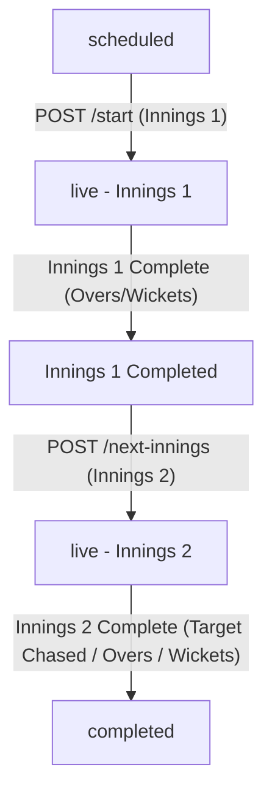

# Live-Scoring System (Kabaddi & Cricket) — Backend Documentation

This document serves as a comprehensive reference guide to the architecture, MongoDB schemas, API endpoints, and business rules implemented in the multi-sport Live-Scoring System Backend (supporting **Kabaddi**, **Cricket**, and **Auth & RBAC**).

---

## 1. Project Architecture

The backend is built as an intermediate-level Node.js application utilizing standard **Express** for the web tier and raw **MongoDB Driver** (v7.5) for the data tier. The project uses ES modules (`type: "module"`) and Zod for schema validation.

### Directory Structure

```text
Scorrer-App/backend
├── bruno/                      # Bruno API collection files for testing
│   ├── Auth/                   # Auth & registration endpoints
│   ├── Cricket/                # Cricket match endpoints
│   ├── Kabaddi/                # Kabaddi match endpoints
│   ├── Roles/                  # Role management endpoints
│   └── User roles/             # User-role assignment endpoints
├── dot_md/                     # Comprehensive documentation files
│   ├── project.md              # [This file] Backend architecture & guide
│   ├── cricket_api_guide.md    # Detailed Cricket API reference guide
│   ├── cricket_rules.md        # Comprehensive Cricket rules documentation
│   ├── kabaddi_rule_book...    # Detailed Kabaddi rules comparison
│   └── antigravity.md          # Workspace system instructions
├── src/
│   ├── config/
│   │   ├── dbConnect/          # MongoDB client connection & collection helper
│   │   │   ├── mongo.js
│   │   │   └── mongoConnect.js
│   │   └── env.js              # Environment variable loader (`dotenv`)
│   ├── middleware/             # Application middlewares
│   │   ├── auth.middleware.js       # JWT Access Token verification
│   │   ├── permission.middleware.js # RBAC permission verification
│   │   └── validate.js              # Zod request validation middleware
│   ├── modules/
│   │   ├── Auth/               # Authentication and Role-Based Access Control (RBAC)
│   │   │   ├── controllers/    # Auth, Roles, and User-Roles controllers
│   │   │   ├── routes/         # Auth routes mapping
│   │   │   └── validations/    # Zod schemas for auth & roles
│   │   ├── cricket/            # Cricket Live-Scoring module
│   │   │   ├── controllers/    # Grounds, teams, and match state-machine controllers
│   │   │   ├── routes/         # Cricket routes mapping
│   │   │   └── validations/    # Zod schemas for cricket actions
│   │   └── kabaddi/            # Kabaddi Live-Scoring module
│   │       ├── circle/         # Circle/Punjab rules engine
│   │       ├── international/  # Standard/National rules engine
│   │       ├── controllers/    # Grounds, teams, and match controllers
│   │       ├── routes/         # Kabaddi routes mapping
│   │       └── validations/    # Zod schemas for kabaddi actions
│   └── apiRoutes.js            # Base v1 router (`/v1/auth`, `/v1/cricket`, `/v1/kabaddi`)
├── server.js                   # Application bootstrap & Express server setup
└── package.json                # Dependencies and project metadata
```

---

## 2. Database Models & Schemas

The application connects via a unified MongoDB connection client and operates across three distinct databases:
1. `auth` — User records, authentication tokens, custom roles, and permission assignments.
2. `kabaddi` — Match setups, squads, grounds, live raid states, and stats.
3. `cricket` — Match setups, squads, grounds, innings-based deliveries, extras, and stats.

---

### A. Auth Database Collections (`auth`)

#### `users`
Tracks registered players, captains, admins, and general users.
```json
{
  "_id": "ObjectId",
  "name": "string",
  "phone": "string (unique)",
  "gender": "enum ['male', 'female']",
  "password": "string (bcrypt hash)",
  "roles": ["string (e.g. 'users', 'admin')"],
  "dob": "Date | null",
  "address": "string | null",
  "city": "string | null",
  "state": "string | null",
  "Country": "string",
  "createdAt": "Date"
}
```

#### `roles`
Stores role names and associated permission strings for RBAC.
```json
{
  "_id": "ObjectId",
  "name": "string (unique)",
  "permissions": ["string (e.g. '*', 'role.view', 'role.create')"],
  "createdAt": "Date",
  "updatedAt": "Date"
}
```

#### `refresh_tokens`
Manages user refresh tokens for long-lived sessions.
```json
{
  "_id": "ObjectId",
  "userId": "ObjectId",
  "tokenHash": "string (SHA-256)",
  "expiresAt": "Date",
  "createdAt": "Date"
}
```

---

### B. Kabaddi Database Collections (`kabaddi`)

#### `grounds`
Venues/stadiums where Kabaddi matches are held.
```json
{
  "_id": "ObjectId",
  "name": "string",
  "city": "string",
  "country": "string"
}
```

#### `teams`
Playing squads containing registered players.
```json
{
  "_id": "ObjectId",
  "name": "string",
  "players": [
    {
      "userId": "ObjectId",
      "role": "enum ['raider', 'defender', 'all_rounder']",
      "isCaptain": "boolean"
    }
  ],
  "createdAt": "Date"
}
```

#### `matches`
Stores scheduled parameters, playing format, toss details, live scoring state, and stats.
```json
{
  "_id": "ObjectId",
  "groundId": "ObjectId",
  "teamAId": "ObjectId",
  "teamBId": "ObjectId",
  "format": "enum ['international', 'circle']",
  "toss": {
    "wonBy": "ObjectId",
    "decision": "enum ['raid', 'defend']"
  },
  "status": "enum ['scheduled', 'live', 'completed']",
  "winnerId": "ObjectId | null",
  "resultMessage": "string",
  "state": {
    "format": "string",
    "toss": "object",
    "teamAId": "ObjectId",
    "teamBId": "ObjectId",
    "currentHalf": "number (1 or 2)",
    "score": {
      "teamA": "number",
      "teamB": "number"
    },
    "teamA": {
      "activePlayers": ["string (userId)"],
      "outPlayers": ["string (userId)"],
      "injuredPlayers": ["string (userId)"],
      "substitutes": ["string (userId)"],
      "squad": ["string (userId)"]
    },
    "teamB": {
      "activePlayers": ["string (userId)"],
      "outPlayers": ["string (userId)"],
      "injuredPlayers": ["string (userId)"],
      "substitutes": ["string (userId)"],
      "squad": ["string (userId)"]
    },
    "consecutiveEmptyRaids": {
      "teamA": "number",
      "teamB": "number"
    },
    "raids": [
      {
        "raiderId": "string",
        "outcome": "string",
        "pointsAttacking": "number",
        "pointsDefending": "number",
        "revivedAttacking": ["string"],
        "revivedDefending": ["string"],
        "outPlayersAttacking": ["string"],
        "outPlayersDefending": ["string"],
        "isBonusScored": "boolean",
        "isSuperTackle": "boolean",
        "defenderId": "string | undefined",
        "foulReason": "string | undefined",
        "eventLog": "string",
        "timestamp": "Date"
      }
    ],
    "timeouts": [
      {
        "teamId": "ObjectId | null",
        "durationSeconds": "number",
        "type": "enum ['team', 'official']",
        "half": "number",
        "timestamp": "Date"
      }
    ],
    "stats": {
      "userIdString": {
        "raids": "number",
        "raidPoints": "number",
        "touchPoints": "number",
        "tacklePoints": "number",
        "bonusPoints": "number",
        "superTackles": "number",
        "outCount": "number"
      }
    }
  },
  "stateHistory": "Array (snapshots of state for Undo, max limit 5)",
  "createdAt": "Date",
  "updatedAt": "Date"
}
```

---

### C. Cricket Database Collections (`cricket`)

#### `grounds`
Venues/stadiums where Cricket matches are held.
```json
{
  "_id": "ObjectId",
  "name": "string",
  "city": "string",
  "country": "string",
  "createdAt": "Date"
}
```

#### `teams`
Playing squads containing registered players (*requires exactly 1 captain and 1 wicketkeeper*).
```json
{
  "_id": "ObjectId",
  "name": "string",
  "players": [
    {
      "userId": "ObjectId",
      "role": "enum ['batsman', 'bowler', 'all_rounder', 'wicket_keeper']",
      "isCaptain": "boolean",
      "isWicketKeeper": "boolean"
    }
  ],
  "createdAt": "Date"
}
```

#### `matches`
State machine entity storing match settings, overs, toss, live innings data, deliveries, and scorecard overview.
```json
{
  "_id": "ObjectId",
  "groundId": "ObjectId",
  "teamAId": "ObjectId",
  "teamBId": "ObjectId",
  "format": "enum ['t20', 'odi', 'custom']",
  "overs": "number",
  "toss": {
    "wonBy": "ObjectId",
    "decision": "enum ['bat', 'bowl']"
  },
  "status": "enum ['scheduled', 'live', 'completed']",
  "winnerId": "ObjectId | null",
  "resultMessage": "string",
  "state": {
    "currentInnings": "number (1 or 2)",
    "freeHit": "boolean",
    "currentBowler": "ObjectId",
    "currentBatsmen": [
      { "userId": "ObjectId", "isStriker": "boolean" }
    ],
    "innings": [
      {
        "battingTeamId": "ObjectId",
        "bowlingTeamId": "ObjectId",
        "runs": "number",
        "wickets": "number",
        "overs": "number (e.g. 1.2)",
        "ballsBowled": "number",
        "extras": {
          "wides": "number",
          "noBalls": "number",
          "byes": "number",
          "legByes": "number",
          "penalty": "number"
        },
        "battingStats": [
          {
            "userId": "ObjectId",
            "runs": "number",
            "balls": "number",
            "fours": "number",
            "sixes": "number",
            "out": "boolean",
            "dismissal": {
              "type": "enum ['bowled', 'caught', 'lbw', 'stumped', 'run_out', 'hit_wicket']",
              "fielderId": "ObjectId | null",
              "bowlerId": "ObjectId"
            }
          }
        ],
        "bowlingStats": [
          {
            "userId": "ObjectId",
            "overs": "number",
            "balls": "number",
            "maidens": "number",
            "runsConceded": "number",
            "wickets": "number"
          }
        ],
        "deliveries": [
          {
            "strikerId": "ObjectId",
            "nonStrikerId": "ObjectId",
            "bowlerId": "ObjectId",
            "runs": "number",
            "isValidBall": "boolean",
            "extras": { "type": "string", "runs": "number" },
            "wicket": { "type": "string", "playerOutId": "ObjectId", "fielderId": "ObjectId" },
            "teamScoreAtBall": "number",
            "wicketsAtBall": "number",
            "oversAtBall": "number",
            "timestamp": "Date"
          }
        ]
      }
    ]
  },
  "createdAt": "Date",
  "updatedAt": "Date"
}
```

---

## 3. Rules Engine & Core Business Logic

### A. Auth & Role-Based Access Control (RBAC)
- **Token Model**: Authenticated requests require a short-lived JWT Access Token (`15m` expiry). Sessions are extended via SHA-256 hashed Refresh Tokens (`30d` default expiry).
- **Dynamic RBAC**: Middleware `permission("permission_string")` inspects user roles from `auth.users` against `auth.roles`. A role with permission `"*"` grants full admin access.

---

### B. Kabaddi Scoring Engine Profiles

#### Standard / National Rules (International)
- **Court**: Rectangular court layout.
- **Starting Lineup**: Exactly 7 players on court per team.
- **Out & Revival**: Touching defenders places them OUT. Raider getting tackled is OUT. Revivals occur in FIFO order of `outPlayers` matching the touch count / tackle outcome.
- **Bonus Point**: Eligible when defending team has $\ge 6$ active players. Raider scores $+1$ point (does not revive). The `isBonusScored` flag is explicitly recorded.
- **Super Tackle**: Active when defending team has $\le 3$ active players. Successful tackle scores $+2$ points to defenders and revives $1$ player.
- **All-Out**: Triggered when a team has $0$ active players. The opposing team scores $+2$ additional points. All players of the defending team (excluding injured) are restored to court.
- **Do-or-Die**: When a team records 2 consecutive empty raids, the 3rd raid MUST score. If empty, the raider is OUT, and the defending team receives $+1$ point + 1 revival.

#### Circle / Punjab Rules
- **Court**: Circular court layout.
- **Starting Lineup**: Exactly 8 players on court per team.
- **Out & Revival**: No players ever go OUT. Everyone remains on court throughout the match.
- **One-on-One**: A raider interacts with one stopper. If two stoppers attack, a `"multiple_stoppers"` defensive foul is called, awarding $+1$ point to the raider.
- **Out of Bounds**: Custom foul logic handles boundary excursions:
  - Stopper steps out of bounds $\rightarrow$ Attacking team receives $+1$ point.
  - Raider steps out of bounds $\rightarrow$ Defending team receives $+1$ point.

---

### C. Cricket Scoring Engine Logic

#### Match State Machine Workflow


#### Ball Recording & Calculation
- **Valid vs Extra Deliveries**: Wide and No-Ball deliveries are marked as `isValidBall: false` and do NOT increment the legitimate ball count for the over.
- **Free Hit Propagation**: A No-Ball triggers a Free Hit on the next delivery. If an illegal delivery (wide/no-ball) occurs on a free hit, `freeHit: true` is preserved for the next ball.
- **Runs & Bowler Conceded Accounting**:
  - **Wide**: $+1$ penalty run + optional extra runs credited to team score and charged to bowler runs conceded.
  - **No-Ball**: $+1$ penalty run + runs off bat / extras credited to team score. Bowler charged $+1$ penalty + bat runs.
  - **Bye / Leg Bye**: Runs added to team score, charged to extras, NOT charged to bowler.
  - **Penalty**: Added to team score, NOT charged to bowler.
- **Strike & Ends Rotation**:
  - Odd runs (1, 3, 5) swap striker and non-striker.
  - Over completion (6 valid balls) swaps striker and non-striker ends.
  - Consecutive overs by the same bowler are prevented.
- **Wicket & Dismissal Logic**:
  - Bowler receives credit for `bowled`, `caught`, `lbw`, `stumped`, and `hit_wicket`.
  - Next batter ID (`nextBatterId`) must be supplied upon wicket occurrence unless all-out.
- **Historical Delivery Edit Engine (`PATCH /matches/:id/ball/:index`)**:
  - Allows editing any previously recorded ball index.
  - Triggers a complete iterative re-simulation of the entire innings state from ball 0, recalculating total runs, wickets, overs, extras breakdown, individual batter/bowler statistics, and win condition evaluation.

---

## 4. Complete API Endpoint Specification

All endpoints are routed under the `/v1` prefix.

### A. Authentication & RBAC (`/v1/auth`)

| Method | Endpoint | Description | Auth Required | Permission |
| :--- | :--- | :--- | :--- | :--- |
| **POST** | `/v1/auth/register` | Register a new user | No | Public |
| **POST** | `/v1/auth/login` | Login user & receive JWT access + refresh tokens | No | Public |
| **POST** | `/v1/auth/refresh` | Refresh expired access token | No | Public |
| **POST** | `/v1/auth/logout` | Revoke refresh token & logout | Yes | Authenticated |
| **GET** | `/v1/auth/allUsers` | Fetch list of all registered users (excluding password) | No | Public |
| **GET** | `/v1/auth/roles` | Fetch all roles | Yes | `role.view` |
| **POST** | `/v1/auth/roles` | Create a new role with permissions | Yes | `role.create` |
| **PATCH**| `/v1/auth/roles/:id` | Update role name or permissions | Yes | `role.update` |
| **DELETE**| `/v1/auth/roles/:id`| Delete role (if unassigned) | Yes | `role.delete` |
| **GET** | `/v1/auth/users/:id/roles` | Fetch assigned roles for a specific user | Yes | `user.role.view` |
| **PATCH**| `/v1/auth/users/:id/roles` | Assign/update roles for a user | Yes | `user.role.update` |

---

### B. Kabaddi Scoring Module (`/v1/kabaddi`)

| Method | Endpoint | Description | Auth Required |
| :--- | :--- | :--- | :--- |
| **POST** | `/v1/kabaddi/grounds` | Create a new venue ground | Yes |
| **GET** | `/v1/kabaddi/grounds` | Fetch all Kabaddi grounds | **No (Public)** |
| **POST** | `/v1/kabaddi/teams` | Create a team squad (min 2 players) | Yes |
| **GET** | `/v1/kabaddi/teams` | Fetch all Kabaddi teams (alphabetical) | **No (Public)** |
| **GET** | `/v1/kabaddi/teams/:id` | Fetch team details with populated user info | **No (Public)** |
| **POST** | `/v1/kabaddi/matches` | Schedule a match (International or Circle) | Yes |
| **POST** | `/v1/kabaddi/matches/:id/start` | Start match & verify court lineups (7 for Int, 8 for Circle) | Yes |
| **POST** | `/v1/kabaddi/matches/:id/raid` | Record a raid outcome | Yes |
| **GET** | `/v1/kabaddi/matches/:id/scorecard` | Retrieve full scorecard with player names & stats | **No (Public)** |
| **PATCH**| `/v1/kabaddi/matches/:id/lineup` | Manually update active court lineups | Yes |
| **POST** | `/v1/kabaddi/matches/:id/end` | Complete match and record winner/result message | Yes |
| **POST** | `/v1/kabaddi/matches/:id/injury` | Mark a player as injured (removes from court) | Yes |
| **POST** | `/v1/kabaddi/matches/:id/substitute` | Perform tactical / injured substitutions | Yes |
| **POST** | `/v1/kabaddi/matches/:id/timeout` | Record official or team timeouts | Yes |
| **POST** | `/v1/kabaddi/matches/:id/switch-half` | Transition match to second half | Yes |
| **POST** | `/v1/kabaddi/matches/:id/undo` | Undo last raid event (rollback state snapshot, up to last 3 raids) | Yes |

---

### C. Cricket Scoring Module (`/v1/cricket`)

| Method | Endpoint | Description | Auth Required |
| :--- | :--- | :--- | :--- |
| **POST** | `/v1/cricket/grounds` | Create a new ground venue | Yes |
| **GET** | `/v1/cricket/grounds` | Fetch all Cricket grounds | **No (Public)** |
| **POST** | `/v1/cricket/teams` | Create a team squad (requires exactly 1 captain & 1 wicketkeeper) | Yes |
| **GET** | `/v1/cricket/teams` | Fetch all Cricket teams | **No (Public)** |
| **GET** | `/v1/cricket/teams/:id` | Fetch team details with populated user info | **No (Public)** |
| **POST** | `/v1/cricket/matches` | Schedule a cricket match | Yes |
| **POST** | `/v1/cricket/matches/:id/start` | Start match & set initial Innings 1 striker, non-striker, bowler | Yes |
| **POST** | `/v1/cricket/matches/:id/next-innings` | Start Innings 2 & set initial striker, non-striker, bowler | Yes |
| **POST** | `/v1/cricket/matches/:id/ball` | Record ball delivery outcome | Yes |
| **GET** | `/v1/cricket/matches/:id/scorecard` | Retrieve complete match scorecard & live overview | **No (Public)** |
| **PATCH**| `/v1/cricket/matches/:id/active-batsmen` | Correction endpoint to update active crease batsmen | Yes |
| **PATCH**| `/v1/cricket/matches/:id/ball/:index` | Correct a past delivery & recalculate full innings scorecard | Yes |
| **POST** | `/v1/cricket/matches/:id/undo` | Undo last ball delivery (rollback state snapshot, up to last 3 balls) | Yes |
